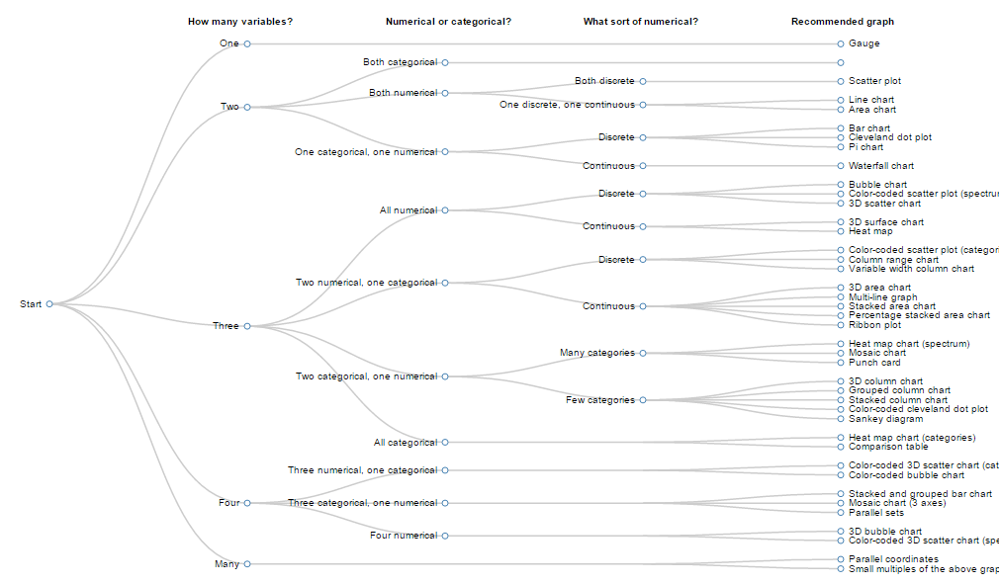

# graph-chooser

## Creating a treemap to guide what graph to use based on what variables you have

I'm working on a guide of what graph to use to plot your data. I'm not a statistician so I get confused when reading guides for what graphs to pick made my statisticans. They're all about intent. ""What information specifically do you want to extract from the data?", "What message are you trying to convey?", "Are you looking for a relationship or a composition?", Etc. 

More often I just find myself with a bunch data and want to visualize it. Graphing it helps me understand it better. There's no other ulterior motive or goal. I just find myself with a table of variables and need to know how to represent it based soley on the data. So I'm creating this for myself and others like me.

(Incomplete)

[Live (unsynchronized) version here](crclayton.com/projects/graph-chooser/index.html)

## Example Images

These should be 400x400 .PNG files. I want to keep them square and I want to keep them small so they load quick. Time lags look really bizarre. 

Where possible, use highcharts to get the image so the examples have a consistent appearance.

They must have the same filename (not including the extension) as their name in the data.json name attribute. The extension must be all lower case.

Ex. { "name": "Example graph name" } must have an image in the /img directory called "Example graph name.png"

## Questions

These should be consistent and exclusively about the data.

1. How many variables?

2. Numerical or categorical?

3. Are numerical variables discrete or continuous?

4. Are categorical variables ordinal or nominal?